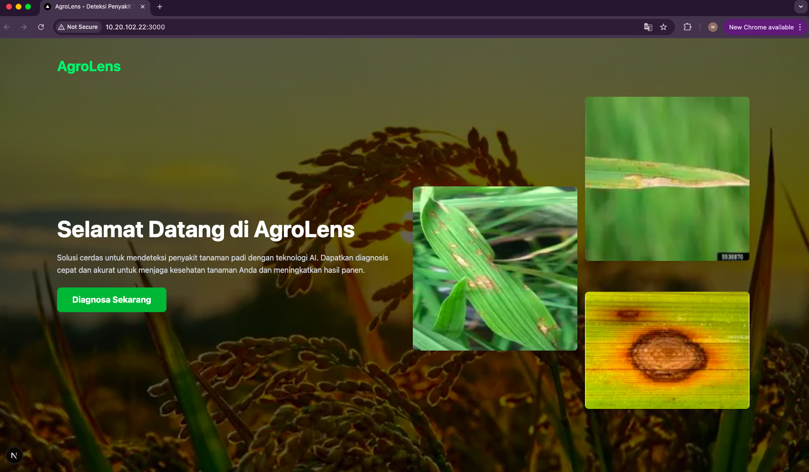
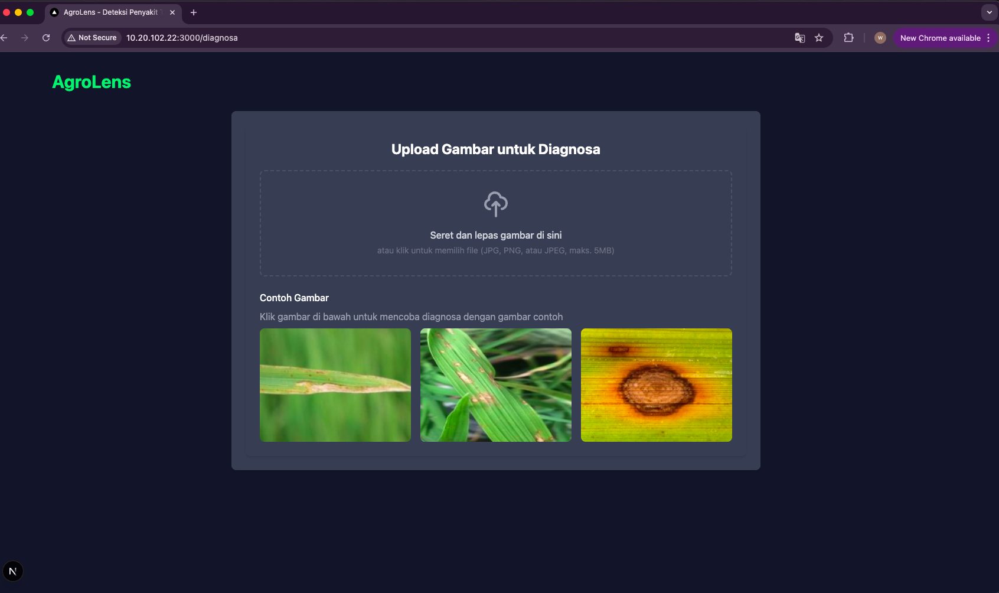
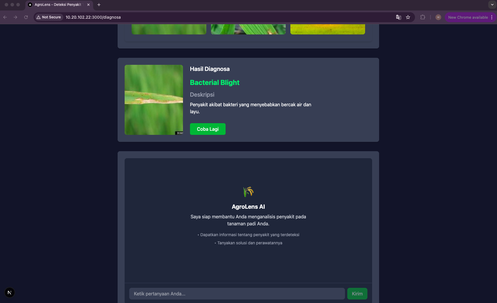
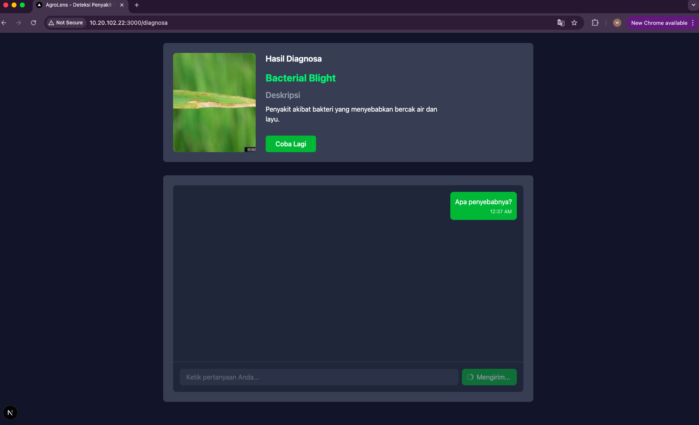

Berikut adalah versi yang telah diperbaiki dan diperindah dari `README.md` untuk **AgroLens-LaskarAI**. Fokusnya adalah menjaga struktur yang rapi, konsisten, dan profesional sambil mempertahankan nuansa proyek AI pertanian yang informatif.

---

# 🌾 AgroLens-LaskarAI

**AgroLens-LaskarAI** adalah proyek AI multimodal untuk analisis pertanian, yang menggabungkan model **klasifikasi citra** dan **pemrosesan bahasa alami (NLP)**. Tujuannya adalah membantu deteksi penyakit tanaman dari gambar daun serta memberikan penjelasan dan solusi secara interaktif dalam Bahasa Indonesia melalui chatbot.

---

## 🚀 Fitur Utama

* 📷 **Klasifikasi Gambar**
  Mendeteksi berbagai penyakit daun tanaman padi secara otomatis dari citra menggunakan model deep learning.

* 🤖 **Chatbot NLP**
  Menjawab pertanyaan tentang gejala, penyebab, dan penanganan penyakit padi dalam Bahasa Indonesia.

* 🖥️ **Antarmuka Web Interaktif**
  Tersedia frontend dan backend yang terhubung ke API untuk diagnosis dan konsultasi pertanian.

* 🧠 **Model NLP Terbuka**
  Model chatbot tersedia di Hugging Face untuk penggunaan publik dan pengembangan lanjutan.

---

## 🌐 Akses Langsung

Kamu bisa mencoba versi live aplikasi dan model melalui tautan berikut:

* 🔗 **Frontend Web**: [agro-lens-web.vercel.app](https://agro-lens-web.vercel.app/)
* 🔗 **Model NLP di Hugging Face**: [AgroLens-Chatbot @ Hugging Face](https://huggingface.co/ARusDian/AgroLens-Chatbot)

> 💡 **Catatan**: Backend juga berjalan di **Hugging Face Spaces**, sehingga kamu bisa langsung menggunakan inferensi chatbot dari web tanpa setup lokal.

---

## 🛠️ Tech Stack

### 🔍 Machine Learning & NLP

* `TensorFlow`, `Keras`, `PyTorch`
* `Transformers`, `datasets`, `tokenizers` (Hugging Face)
* `scikit-learn`, `opencv-python`, `scikit-image`, `Pillow`
* `faiss-gpu` untuk pencarian vektor

### 🌐 Backend

* `FastAPI`, `Uvicorn`
* `Pandas`, `NumPy`

### 💻 Frontend

* `React.js` + `Vite`
* `Tailwind CSS`

### ☁️ Deployment

* **Frontend**: [Vercel](https://vercel.com)
* **Backend/NLP Model**: [Hugging Face Spaces](https://huggingface.co/spaces)
* **Repo Code**: [GitHub](https://github.com/ARusDian/AgroLens-LaskarAI)

---

## 📦 Kebutuhan Sistem

* **Python**: Versi 3.10 atau lebih baru
* **Node.js**: Untuk frontend
* **Jupyter Notebook**: Untuk eksperimen ML

### Library Python (utama)

```txt
tensorflow
torch
transformers
datasets
tokenizers
scikit-learn
pandas
numpy
opencv-python
scikit-image
Pillow
faiss-cpu
fastapi
uvicorn
ipywidgets
openpyxl
```

---

## ⚙️ Cara Menjalankan Proyek Secara Lokal

### 1. Clone Repository

```bash
git clone https://github.com/ARusDian/AgroLens-LaskarAI.git
cd AgroLens-LaskarAI
```

### 2. Siapkan Environment Python

```bash
python -m venv venv
source venv/bin/activate  # atau venv\Scripts\activate di Windows
```

### 3. Jalankan Backend

```bash
cd web/agrolens-backend
python main.py
```

> 🧪 Backend juga tersedia di Hugging Face Spaces jika kamu hanya ingin menguji chatbot tanpa install lokal.

### 4. Jalankan Frontend

```bash
cd ../agrolens-frontend
npm install
npm run dev
```

---

## 🖼️ Tampilan Aplikasi

### Halaman Depan



### Halaman Diagnosa



### Hasil Klasifikasi Gambar



### Prompt Chatbot



### Hasil Chatbot


---

## 📚 Lisensi

Proyek ini dikembangkan untuk tujuan edukatif dan solusi praktis dalam pertanian digital.
Silakan gunakan, kembangkan, dan kontribusikan sesuai kebutuhan.
