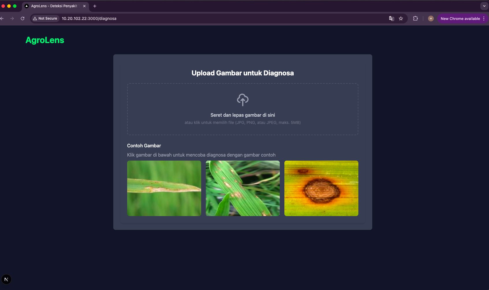
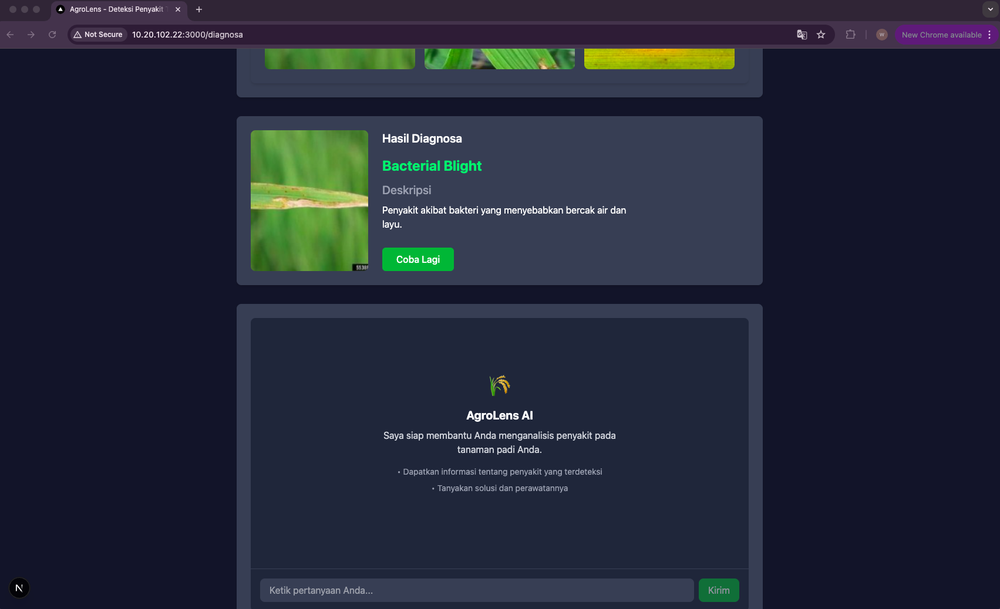
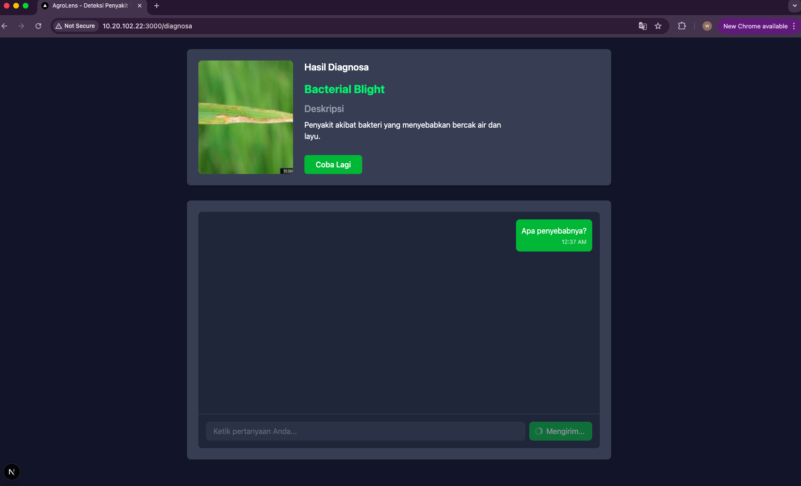
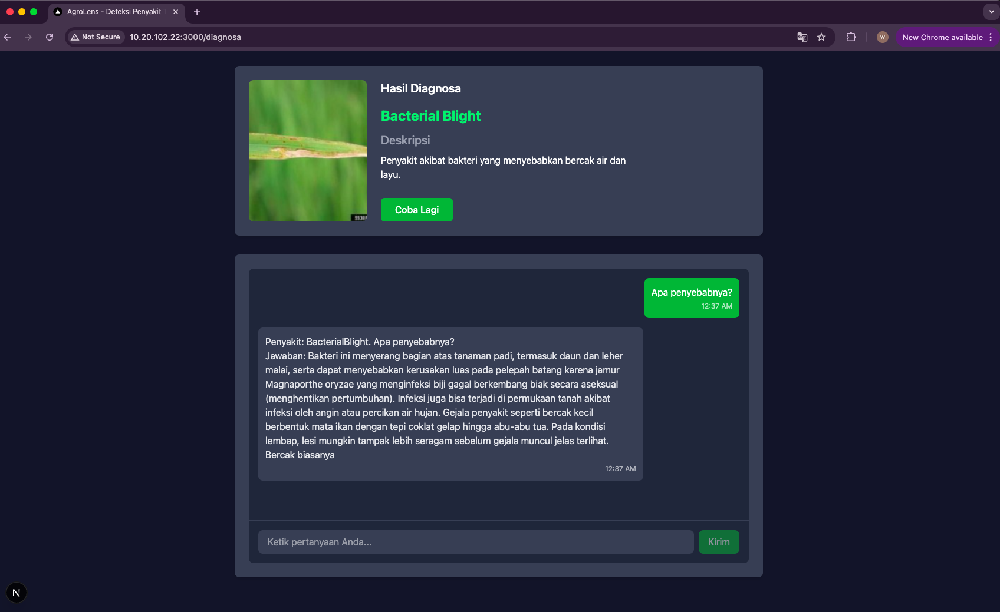

# 🌾 AgroLens-LaskarAI

**AgroLens-LaskarAI** adalah proyek AI multimodal untuk analisis pertanian, menggabungkan model klasifikasi citra dan pemrosesan bahasa alami (NLP). Proyek ini dirancang untuk mendeteksi penyakit tanaman melalui gambar dan menjawab pertanyaan pertanian dalam Bahasa Indonesia melalui chatbot.

---

## 🚀 Fitur Utama

* 📷 **Klasifikasi Gambar**: Model pembelajaran mesin untuk mendeteksi berbagai penyakit tanaman dari citra daun.
* 🤖 **Chatbot NLP**: Menjawab pertanyaan seputar penyakit tanaman padi menggunakan Bahasa Indonesia.
* 🖥️ **Antarmuka Web**: Sistem frontend dan backend yang memungkinkan interaksi pengguna dan layanan API.

---

## 🌐 Akses Langsung

Kamu bisa mencoba aplikasi ini secara langsung melalui link berikut:

🔗 **[AgroLens Web (Live Demo)](https://agro-lens-web.vercel.app/)**

---

## 📦 Kebutuhan Sistem

* **Python**: Versi 3.12 atau lebih baru
* **Jupyter Notebook**
* **Library Python**:

  * `TensorFlow`, `PyTorch`, `scikit-learn`, `pandas`, `numpy`, `openpyxl`, `ipywidgets`, `fast-api`, dll.
* **Node.js**: Untuk menjalankan antarmuka frontend

---

## ⚙️ Cara Menjalankan Proyek Secara Lokal

### 1. Clone Repository

```bash
git clone https://github.com/ARusDian/AgroLens-LaskarAI.git
cd AgroLens-LaskarAI
```

### 2. Siapkan Environment Python

```bash
python -m venv venv
source venv/bin/activate  # atau venv\Scripts\activate di Windows
```

### 3. Jalankan Backend

```bash
cd web/agrolens-backend
python main.py
```

### 4. Jalankan Frontend

```bash
cd ../agrolens-frontend
npm install
npm run dev
```

---

## 🖼️ Tampilan Aplikasi

### Halaman Depan


### Halaman Diagnosa



### Hasil Klasifikasi Gambar



### Prompt Chatbot



### Hasil Chatbot



---

## 📚 Lisensi

Proyek ini dikembangkan untuk tujuan edukatif dan solusi praktis di bidang pertanian. Silakan gunakan, modifikasi, dan kontribusi sesuai kebutuhan Anda. Untuk informasi lebih lanjut, lihat file LICENSE.
