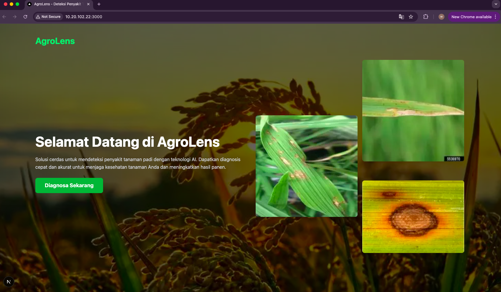
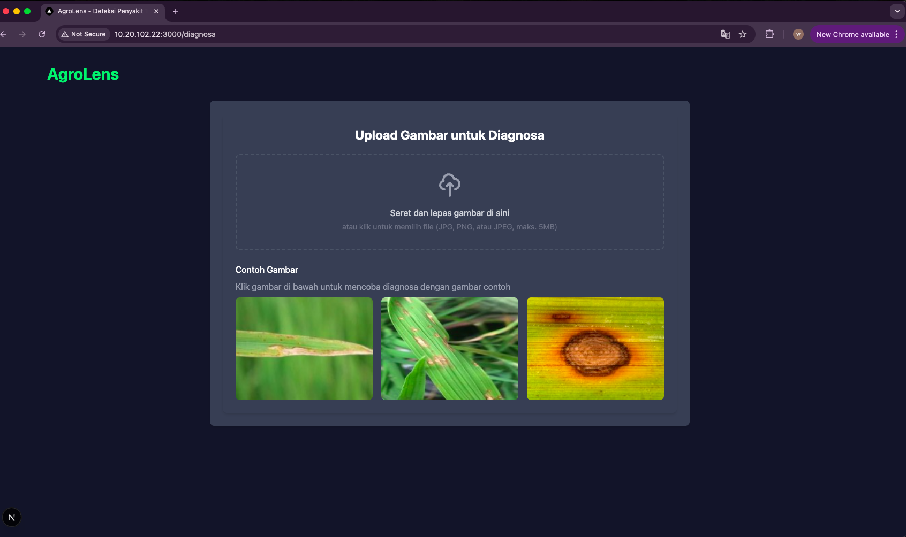
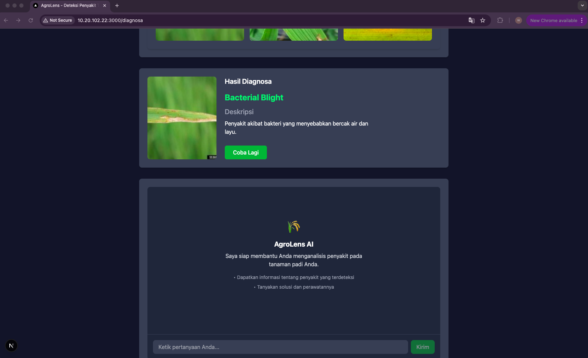
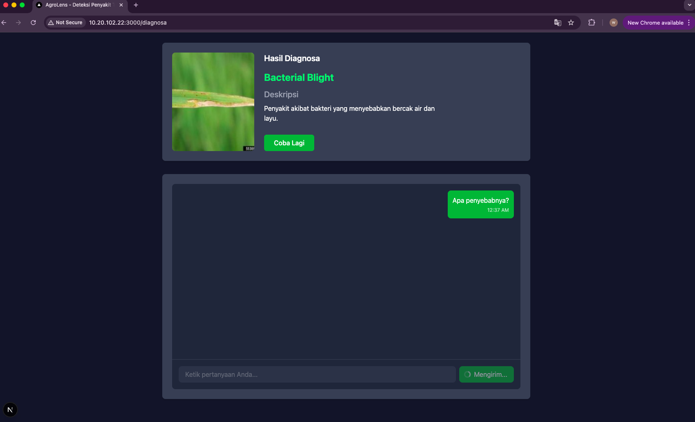
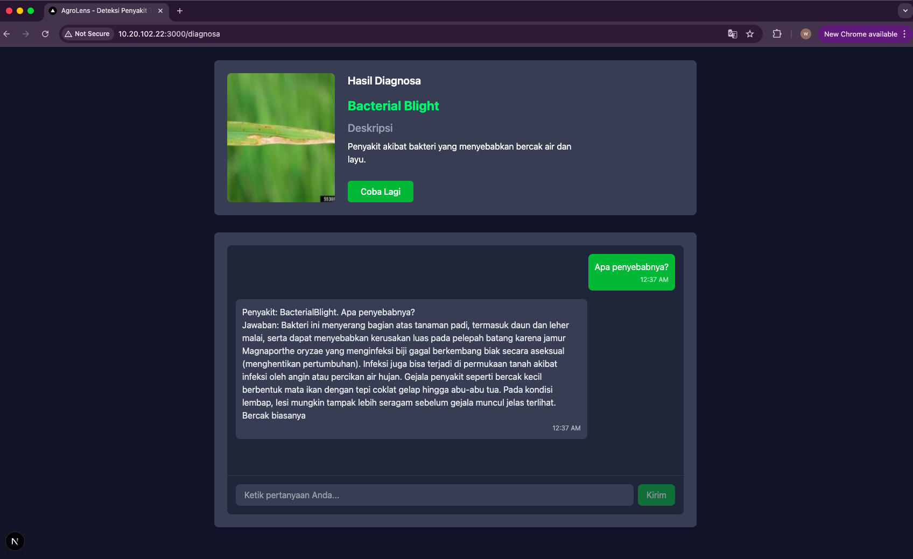

# 🌾 AgroLens-LaskarAI

### *AI for Smarter Farming — Empowering Indonesia’s Agriculture with Intelligent Insight*

**AgroLens-LaskarAI** is an **AI-driven agricultural intelligence platform**, integrating **image classification** and a **fine-tuned Large Language Model (LLM)** derived from **IndoGPT**.
The system diagnoses rice leaf diseases from images and delivers **context-aware, Indonesian-language explanations and treatments**, bridging data science and local farming wisdom.

---

## 🚀 Key Features

* 📷 **Intelligent Disease Detection**
  Deep learning–based image classification that accurately identifies multiple rice leaf diseases from visual inputs.

* 🧠 **Fine-tuned IndoGPT LLM Chatbot**
  A specialized agricultural assistant fluent in **Bahasa Indonesia**, capable of explaining symptoms, causes, and treatments.
  *(Not multimodal — optimized purely for conversational agricultural reasoning.)*

* 🖥️ **Interactive Web Platform**
  Full-stack web system enabling farmers, students, and researchers to upload leaf images, receive instant analysis, and interact with the AI for agricultural advice.

* 🔓 **Open and Extensible AI Model**
  The fine-tuned **IndoGPT model** is publicly available on Hugging Face, enabling customization for research and regional language adaptation.

---

## 🌐 Live Access

Experience AgroLens in action:

* 🔗 **Frontend Web App**: [agro-lens-web.vercel.app](https://agro-lens-web.vercel.app/)
* 🔗 **LLM Model on Hugging Face**: [AgroLens-Chatbot @ Hugging Face](https://huggingface.co/ARusDian/AgroLens-Chatbot)

> 💡 **Note:** The backend is hosted on **Hugging Face Spaces**, allowing direct chatbot inference online without any local setup.

---

## 🛠️ Tech Stack

### 🔍 Machine Learning & LLMs

* `TensorFlow`, `Keras`, `PyTorch`
* `Transformers`, `datasets`, `tokenizers` (Hugging Face)
* `scikit-learn`, `opencv-python`, `scikit-image`, `Pillow`
* `faiss-gpu` — for vector search and knowledge retrieval

### 🌐 Backend

* `FastAPI`, `Uvicorn`
* `Pandas`, `NumPy`

### 💻 Frontend

* `React.js` + `Vite`
* `Tailwind CSS`

### ☁️ Deployment

* **Frontend** — [Vercel](https://vercel.com)
* **Backend / LLM Model** — [Hugging Face Spaces](https://huggingface.co/spaces)
* **Source Code** — [GitHub Repository](https://github.com/ARusDian/AgroLens-LaskarAI)

---

## 📦 System Requirements

* **Python** ≥ 3.10
* **Node.js** for frontend build
* **Jupyter Notebook** for model experimentation

### Main Python Libraries

```txt
tensorflow
torch
transformers
datasets
tokenizers
scikit-learn
pandas
numpy
opencv-python
scikit-image
Pillow
fastapi
uvicorn
ipywidgets
openpyxl
```

---

## ⚙️ Running the Project Locally

### 1. Clone the Repository

```bash
git clone https://github.com/ARusDian/AgroLens-LaskarAI.git
cd AgroLens-LaskarAI
```

### 2. Set Up Python Environment

```bash
python -m venv venv
source venv/bin/activate  # or venv\Scripts\activate on Windows
```

### 3. Run the Backend

```bash
cd web/agrolens-backend
python main.py
```

> 🧪 Alternatively, access the hosted backend directly on Hugging Face Spaces.

### 4. Run the Frontend

```bash
cd ../agrolens-frontend
npm install
npm run dev
```

---

## 🖼️ Application Preview

### Landing Page



### Diagnosis Page



### Image Classification Result



### Chatbot Interaction




---

## 📚 License

This project was built as part of **Laskar AI Indonesia** initiative to advance **digital agriculture** through open AI systems.
You are free to use, adapt, and extend it — for learning, research, or real-world implementation.

> 🌱 *From data to dialogue, AgroLens is where machine learning meets the heart of the field.*
